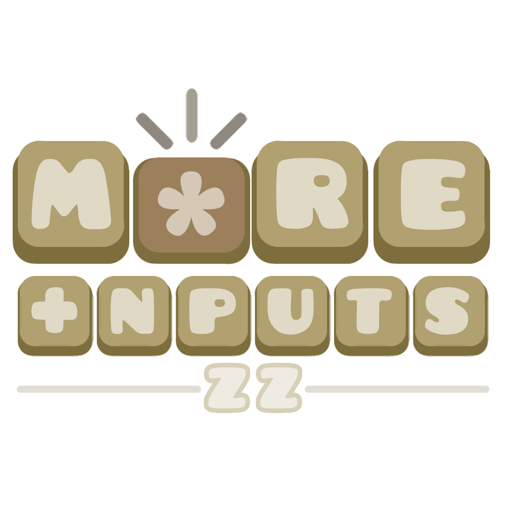

# More Inputs Mod

  

A mod that adds more inputs to the game via <ca>actions</c>.

## Features

- **Almost Full Keyboard Support**: All buttons and be hooked, except some like Windowns or other that was crashing my game
- **Action-Oriented**: Any inputs are from actions, making it more standardized 
- **Touch Macro**: The custom trigger on the new tab that hooks actions to group Ids
- **Vanilla-Friendly**: Any custom trigger is just a cluster of vanilla triggers, the only thing that is being added is a connection between the level and client 

## Usage

You can <cy>create</c>, <cj>edit</cj> and <cr>delete</cr> using the Setup Button on the new <cc>More Inputs Tab</c>.

You also can <cg>hook</c> the actions using the <cl>Touch Macro</c>

## Support

Current i dont have any way to recieve money via donations, but i accept your contribution on my [Tiktok](https://www.tiktok.com/@zumbisinho_) or on my [Youtube](https://www.youtube.com/@Zumbisinho).

## Special Thanks

- To the entire **Quebra Nozes server**
- [**iAndy_HD3**](user:1688850) - IDK if i need to but you had the same idea that i had but with 3 months early
- **Geode dev-chat** - thanks for all the help that i received from those good developers
- **GitHub actions** - macOs running out of minutes for my account
- **Dj Zvitor Original** - The best DJ on the planet
